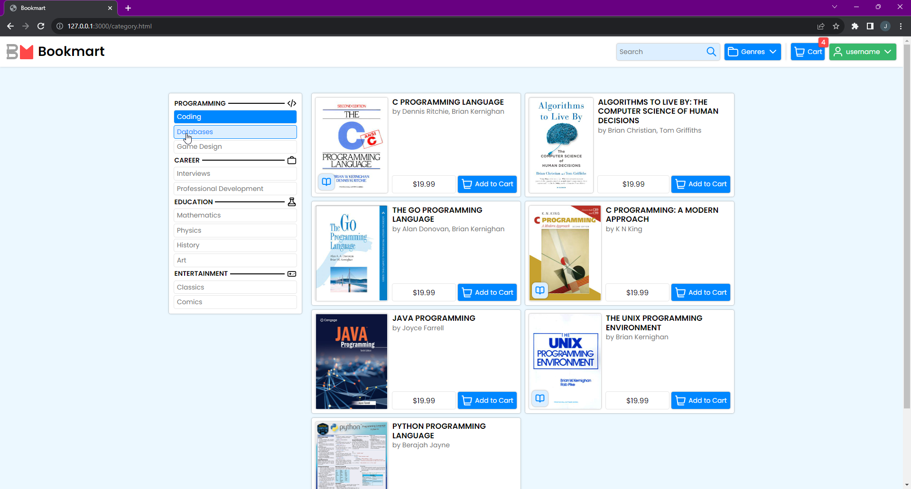
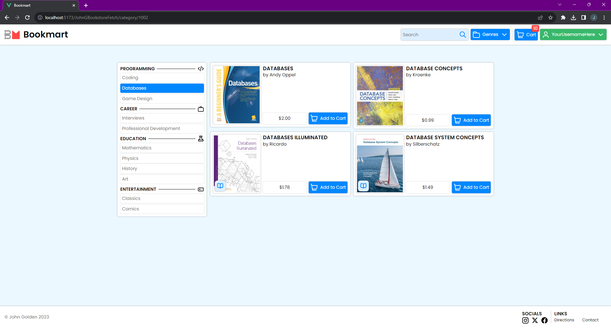
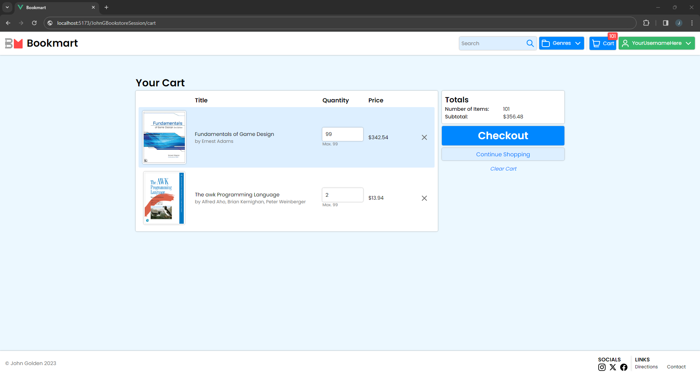

# Bookmart (Vue)

This is a semester-long project I created for an undisclosed class at Virginia Tech. It is an eCommerce-like website written in Vue that had a backend supported by Jakarta EE (course choice), that I designed in Figma and implemented from scratch.

I have chosen not to include the Jakarta EE backend because much of it was fill-in-the-blank template work&mdash;it doesn't reflect any of my personal ability.

## Images & Content

This README was written long after class conclusion, so the provided resources are ones submitted for assignments:

### HTML Draft Implementations (2)

#### Splash Page

#### Category Page

### Vue Implementation (2)

These are images of the site functional with the supporting Java backend.

#### Category Page w/ Page Querying

#### Checkout Page

